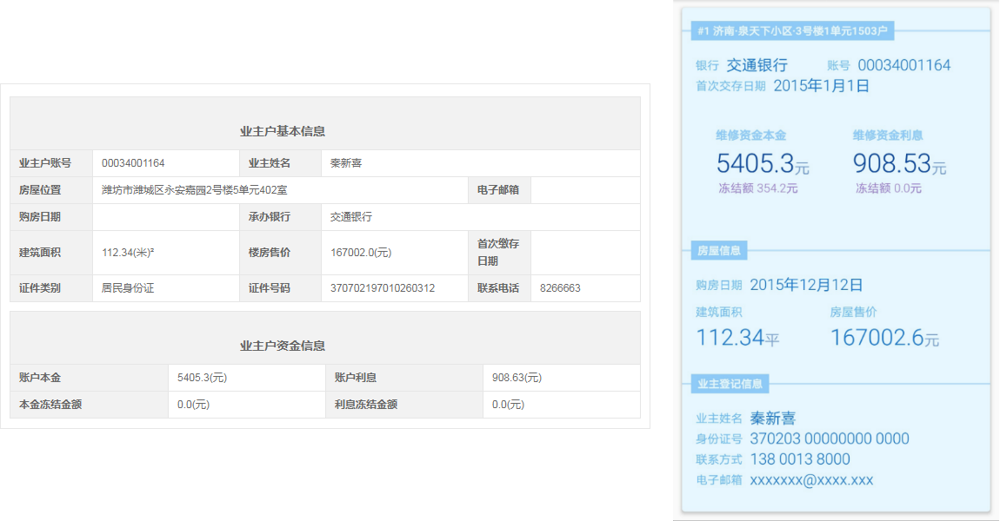

## 3-03至3-08工作总结

### 本周工作

这周主要是实现上周定的结构，并让它可以运行起来。目前已经可以用angulardart框架编译完成，使用auqueduct作为路由，并用手机访问到（使用了ngrok提供的免费二级域名，转到本地的特定端口），并且我需要的特性，也都确定可以实现。

我看了几个上周提到的[Gallery](https://dart-lang.github.io/angular_components/)中会用到的组件在手机上使用效果，确实还不错。以下这个是查询的网页端与手机端的对比。

项目的代码目前是放在[mandui/wechat-project](https://github.com/mandui/wechat-project)上，由于新东西很多，有许多配置调试的坑也很多，我觉得王哥说的对，就一边写一些文档记录，一边写代码。等积累得多一些之后再分类整理。

目前的文档说明有：

[对于project整体说明](https://github.com/mandui/wechat-project)

[AngularDart部分说明](https://github.com/mandui/wechat-project/tree/master/client)

[Aqueduct部分说明](https://github.com/onth3road/dart_aqueduct/tree/master/server)：Aqueduct本来打算下午写的...可是放假的诱惑好大....我我我回去再补上。

### 下周工作

- 目前的需求上需要有 a.验证页面(包括身份证、人脸、短信) b.小区选择页面 c.房屋信息页面 d.账目明细页面。c和d比较简单，a需要和微信服务器交互，b需要和本地数据库交互，希望下周能把c和d写完；

- dart中有js支持，有许多需要调用微信js sdk的地方，下周需要调试，看是否加一个中间层，会不会需要做一些调整转换。